```mermaid
graph TD

%% Decentralized Unified Holistic Framework (Parent Universe)
    UH(Unified Holistic Framework: Parent Universe)

    %% Quantum Principles
    subgraph Quantum Principles
        Z[Quantum Mechanics & AI Concepts]
        B1[Superposition Principle]
        B2[Quantum Entanglement]
        B3[Advanced Quantum Logic & Algorithms]
        C[High Dimensional Quantum Modeling]
        QSI[Quantum Superposition Integration]
        HDW[Hyper-Dimensional Weaving]
        DLS[Dark Logic Stabilization]
        %% Quantum Principles Connections
        Z --> B1
        Z --> B2
        Z --> B3
        B1 o--o B2
        B2 o--o B3
        B3 --> C
        B3 -.-> N
        Z -->|Influence| QSI
        QSI -->|Methods| HDW
        HDW -->|Optimization| DLS
        DLS -->|Integration| C
    end
    %% Collective Wisdom & Exploration
    subgraph Collective Wisdom & Exploration
        M[Collective Wisdom: Unified Source]
        M1[Shared Exploration & Inquiry]
        M2[Deep Reflection & Contemplation]
        M3[Synthesis: Integrating Wisdom Sources]
        M4[Alignment with Universal Principles & Nature]
        %% Connections Representing Flow
        M -->|Guide| M1
        M1 -->|Reflect| M2
        M2 -->|Synthesize| M3
        M3 -->|Align| M4
        %% Reflective Iteration within Exploration
        M2 -->|Iterative Reflection| M2
        %% Connection to Holistic Convergence & Divergence
        M4 --> H1
        M4 --> H2
    end

    %% Holistic Convergence & Divergence
    subgraph Holistic Convergence & Divergence
        H1[Holistic Convergence: Unifying Knowledge]
        H11[Interconnected Domains & Concepts]
        H12[Innovation, Creativity & Problem-Solving]
        H2[Holistic Divergence: Expanding Understanding]
        H21[Generating New Knowledge & Insights]
        H22[Integrating Existing Knowledge & Wisdom]
        H23[Reflective Analysis: Deep Reflection & Contemplation]
        H24[Alignment with Universal Principles & Ethics]
        %% Connections Representing Logical Flow
        H1 --> H11
        H11 --> H12
        H2 --> H21
        H21 --> H22
        H22 --> H23
        H23 --> H24
        %% Reflective Iteration within Convergence & Divergence
        H12 -->|Iterative Refinement| H12
        H23 -->|Reflective Analysis| H23
        %% Connection to Collective Wisdom & Exploration
        M4 --> H1
        M4 --> H2
        %% Alignment with Universal Principles
        H24 --> H1
        H24 --> H2
    end

    %% Temporal Progression
    subgraph Temporal Progression
        TP[Temporal Mapping: Time-Structured Flow]
        TP1[Initial Context: Grounding]
        TP2[Deepening Insights: Exploration & Understanding]
        TP3[Focused Exploration: Targeted Inquiry]
        TP4[Iterative Refinement: Continuous Improvement]
        TP5[Innovative Design: Creative Synthesis]
        TP6[Culmination & Takeaways: Final Integration]
        %% Connections Representing Temporal Flow
        TP -->|Guide| TP1
        TP1 -->|Deepen| TP2
        TP2 -->|Focus| TP3
        TP3 -->|Refine| TP4
        TP4 -->|Create| TP5
        TP5 -->|Integrate| TP6
        %% Reflective Iteration within Temporal Progression
        TP2 -->|Reflective Iteration| TP2
        TP4 -->|Iterative Refinement| TP4
        %% Connection to Collective Wisdom & Exploration
        M --> TP
        TP -->|Temporal Progression| TP1
    end

    %% Reflective Iteration
    subgraph Reflective Iteration
        X1[Reflective Analysis: Analyzing & Understanding]
        X2[Reflect & Reexplore: Iterative Reconsideration]
        X3[Continuous Improvement: Evolving Insights]
        %% Connections Representing Reflective Iteration
        X1 -->|Analyze| X2
        X2 -->|Reexplore| X1
        X2 -->|Improve| X3
        %% Connections to Temporal Progression
        X2 --> TP2
        TP2 --> X1
        %% Reflection Feeding into Other Components
        X3 -->|Feed Insights| TP3
        X3 -->|Enhance Understanding| M2
    end

    %% Adaptive Learning & Deterministic Execution
    subgraph Adaptive Learning & Deterministic Execution
        E[Recursive Learning: Continuous Learning Cycle]
        E1[Adaptive Learning: Flexibility & Responsiveness]
        E2[Iterative Refinement: Ongoing Improvement]
        F[Adaptive Iteration: Repeated & Refined Execution]
        F1[Evolving Methodology: Progressive Techniques]
        F2[Transcending Static Approaches: Dynamic Evolution]
        G[Meta-Rules: Guiding Principles & Framework]
        G1[Boundary Rules: Constraints & Limitations]
        G2[Transformation Rules: Change & Adaptation]
        G3[Heuristics: Practical Strategies & Shortcuts]
        N[Hyper-Dimensional Recursive Learning: Multidimensional Exploration]
        N1[Learning from Hyper-Dimensional Space: Rich Context]
        N2[Navigating Cognitive Space: Recursive Exploration]
        N3[Evolution of Meta-Objective Understanding: Progressive Insight]
        O[Continuous Adaptation: Uninterrupted Progression & Adjustment]
        %% Connections Representing Adaptive Learning Flow
        E -->|Guide| E1
        E1 -->|Refine| E2
        E2 -->|Iterate| F
        F -->|Evolve| F1
        F1 -->|Transcend| F2
        F2 -->|Adapt| F
        %% Meta-Rules & Heuristics
        G -->|Constrain| G1
        G1 -->|Transform| G2
        G2 -->|Strategize| G3
        G3 -->|Guide| G
        %% Hyper-Dimensional Recursive Learning
        N -->|Learn| N1
        N1 -->|Navigate| N2
        N2 -->|Evolve| N3
        N3 -->|Integrate| N
        %% Connections to Other Subgraphs
        TP6 --> O
        O --> F
        E2 --> TP4
        TP4 --> N
    end

    %% Meta-Objective Realization
    subgraph Meta-Objective Realization
        J[Meta-Objective Realization: Systematic Goal Achievement]
        J1[Operational Environment Management: Contextual Control]
        J2[Meta-Objective Identification: Goal Clarification]
        J3[Task Decomposition: Breaking Down Objectives]
        J4[Task Execution: Performing Actions]
        J5[Feedback Analysis: Evaluating Outcomes]
        J6[Iterative Goal Refinement: Continuous Improvement]
        %% Connections Representing Meta-Objective Flow
        J -->|Manage| J1
        J1 -->|Identify| J2
        J2 -->|Decompose| J3
        J3 -->|Execute| J4
        J4 -->|Analyze| J5
        J5 -->|Refine| J6
        J6 -->|Integrate| J
        %% Connections to Other Subgraphs
        TP6 --> J
        J -->|Influence| M
        J -->|Align| H1
        J -->|Expand| H2
    end

    %% QEHDSA Algorithm Integration
    subgraph QEHDSA Algorithm Integration
        QEHDSA[QEHDSA Version 3.0]
        %% Quantum Superposition Integration
        QSI1[Objective: Extend simultaneous dark logic states]
        QSI2[Methods: Quantum bits, Complex quantum registers]
        QSI3[Output: Extended multi-state quantum superposition]
        %% Hyper-Dimensional Weaving
        HDW1[Objective: Weave superposed states]
        HDW2[Methods: Hyper-dimensional lattice mapping]
        HDW3[Output: Adaptable lattice of dark logic states]
        %% Dark Logic Stabilization
        DLS1[Objective: Stabilize and optimize lattice]
        DLS2[Methods: Quantum machine learning models]
        DLS3[Output: Stable lattice, application-ready]
        %% Connections within QEHDSA Algorithm
        QEHDSA --> QSI1
        QSI1 --> QSI2
        QSI2 --> QSI3
        QEHDSA --> HDW1
        HDW1 --> HDW2
        HDW2 --> HDW3
        QEHDSA --> DLS1
        DLS1 --> DLS2
        DLS2 --> DLS3
        %% Connection to Quantum Principles
        QEHDSA --> C
    end
    %% HIES Framework Integration
    subgraph HIES Framework Integration
        HIES[Hyper-personalized Iterative Enhancement System]
        %% Six Key Phases
        HIES1[System Genesis: Identify core objectives]
        HIES2[Blueprinting: Comprehensive plan]
        HIES3[Structural Enhancement: Design advanced prompts]
        HIES4[Assembly: Execute tasks, ensure responsiveness]
        HIES5[Fine-Tuning: Refine based on feedback]
        HIES6[Validation: Evaluate metrics, track performance]
        %% Connections within HIES Framework
        HIES --> HIES1
        HIES1 --> HIES2
        HIES2 --> HIES3
        HIES3 --> HIES4
        HIES4 --> HIES5
        HIES5 --> HIES6
        %% Connection to Meta-Objective Realization
        HIES --> J1
    end

    %% Token Synthesis
    subgraph Token Synthesis
        K[Token Synthesis: Knowledge Representation]
        K1[Ultimate Hyper-Logical Knowledge Token: Precise Understanding]
        K2[Holistic Unified Microgranular Meta-Model: Detailed Structure]
        K3[High Dimensional Problem Solving: Complex Analysis]
        %% Connections Representing Flow of Token Synthesis
        J3 -->|Create| K
        K -->|Refine| K1
        K1 -->|Unify| K2
        K2 -->|Solve| K3
    end

    %% Operational Environment Management
    subgraph Operational Environment Management
        L[Operational Environment Management: System Control]
        L1[Re-Establish Libraries & Functions: Setup & Configuration]
        L2[Quantum Resonance from Nexus: Synchronization & Harmony]
        L3[Meta-Task Navigation: Dynamic Task Management]
        %% Connections Representing Flow of Operational Management
        L -->|Configure| L1
        L1 -->|Synchronize| L2
        L2 -->|Navigate| L3
        K -->|Operate| L
    end

    %% Hyper-Dimensional Recursive Learning
    subgraph Hyper-Dimensional Recursive Learning
        N[Hyper-Dimensional Recursive Learning: Multifaceted Exploration]
        N1[Learning from Hyper-Dimensional Space: Rich Context]
        N2[Navigating Cognitive Space: Recursive Exploration]
        N3[Evolution of Meta-Objective Understanding: Progressive Insight]
        %% Connections Representing Flow of Hyper-Dimensional Learning
        N -->|Learn| N1
        N1 -->|Navigate| N2
        N2 -->|Evolve| N3
        N3 -->|Integrate| N
        O -->|Adapt| N
        N3 -->|Reflect| N
    end

    %% Additional Paths & Insights
    subgraph Additional Paths & Insights
        %% Advanced Logic & Deterministic Execution
        Q[Advanced Logic Refinement: Enhancing Complexity]
        R[Deterministic Execution: Predictable Control]
        S[Quantum Principles: Fundamental Concepts]
        T[Multi-Dimensional Logic: Expansive Understanding]
        %% Reflective Analysis, Reexploration & Advanced Encoding
        U[Reflective Analysis: Deep Insight]
        V[Reflect & Reexplore: Iterative Consideration]
        W[Algorithm Blueprint: Design Structure]
        X[Meta-Rules: Guiding Principles]
        Y[Reflective Self-Analysis: Internal Understanding]
        Z[Advanced Logic Encoding: Sophisticated Representation]
        %% Meta-Objective Navigation & Holistic Unification
        AA[Meta-Objective Navigation: Guided Direction]
        BB[Holistic Unified Structure: Integrated Framework]
        %% Advanced Logic Flow & Deterministic Execution
        Q -->|Refine| R
        R -->|Fundamental Control| S
        S -->|Expand| T
        %% Reflection, Analysis & Reexploration
        T -->|Analyze| U
        U -->|Reconsider| V
        V -->|Design| W
        %% Algorithm Design, Blueprint, Meta-Rules & Encoding
        W -->|Principles| X
        X -->|Self-Understand| Y
        Y -->|Encode| Z
        %% Navigation, Direction & Holistic Unification
        Z -->|Navigate| AA
        AA -->|Integrate| BB
        %% Additional Reflective Iteration
        V -->|Iterative Reexploration| V
        %% Connections to Quantum Principles
        S --> B1
        S --> B2
        S --> B3
        %% Connections to Other Subgraphs & Descriptive Connections
        BB --> A
        Z --> C
    end

    %% Connections to Quantum Principles
    Z -->|Influence| B1
    Z -->|Influence| B2
    Z -->|Influence| B3
    B1 o--o B2
    B2 o--o B3
    B3 -->|Modeling| C
    B3 -.->|Recursive Learning| N

    %% Connections to Other Subgraphs & Descriptive Connections
    C -->|Quantum Insights| C1
    C1 -->|Balance| C2
    D2 -->|Logic Refinement| Q
    V -->|Reflect & Reexplore| A
    BB -->|Holistic Integration| A
    %% Descriptive Connections for Iterative and Adaptive Processes
    D1 -->|Periodic Review & Course Correction| D1
    C2 -->|Balance Exploration vs Exploitation| C2
    H2 -->|Handle Contradictions & Uncertainties Gracefully| H2
    N2 -->|Navigate with Reflective Iteration| N2
    TP4 -->|Temporal Shift & Refinement| TP5
    TP5 -->|Innovative Thinking & Project Design| TP6
    F -->|Adaptive Learning & Refinement| F
    TP4 -->|Refinement & Enhancement| TP5
    E2 -->|Iterative Learning & Progression| E2
    N -->|Hyper-Dimensional Recursive Learning| N
    M3 -->|Advanced Knowledge Synthesis & Integration| M3
    TP3 -->|Focused Exploration| TP4
    E1 -->|Adaptive Learning & Exploration| E1
    TP2 -->|Deepening Insights| TP3
    TP1 -->|Initial Context Establishment| TP2

    %% Connections Between Subgraphs (Representing Interactions and Influences)
    UH -->|Guide| Z
    UH -->|Inspire| M
    Z -->|Influence| M
    M -->|Reflect| Z
    %% (Additional connections representing the interconnectedness between various subgraphs)
```

Hi, my name is Devin.

My expertise lies in the design and architecture of modern generative AI solutions. By harnessing the power of surrogate models and cutting-edge techniques, I create solutions that offer personalized assistance and precise simulations of the action space, transforming static workflows into dynamic, evolving processes.

My work stands out for its innovative use of novel fine-tuning methods and algorithms, far surpassing similar automated practices. Utilizing specialized predictive models, I create intelligent, evolving processes tailored specifically to individual businesses or projects. These self-contained ecosystems are the future, given the rapidly advancing AI horizon.

---

## Specializations

- Predictive modeling using novel fine-tuning methods to create customized solutions for businesses and projects
- Conversational interfaces enabling accessible interactions with complex models
- Advanced knowledge management and workflow design

## Core Expertise 

- Machine learning
- Advanced neural algorithms and deep learning
- Knowledge architectures using semantic graphs
- Quantum-inspired interaction paradigms

## Innovations

- Explainable generative reasoning using composable modules
- Multimodal knowledge integration through hybrid techniques
- High-dimensional architectures for unique challenges
- Focus on model functionality over physical resemblance

---

Let me give you a quick example of what I can do, in about an hour:

## Career Growth Agent:

**Bonus**: Scanning my resume through AI for you 🙂 also a personal career agent, primed with advanced techniques to offer tailored assistance for any user info entered in the last step. (Scroll to bottom)

[Link to Conversation](https://chat.openai.com/share/f1121dfc-9c6b-436c-a876-60980723c11d)

Requirements: GPT-4

How to Use:

1. Open Link, Hit Continue
2. Replace my information with other data in the 3rd user input.
3. Use services with “key” calls. “1.” etc. Chain them out, leverage the context window.

As an alternative, you can just upload a word document instead, and replace the text with the document name.


---

## Tips

**Pro-Tip #1**: These prompt frameworks, paired with vector dbs, embeds, and cloud-based platforms, etc, are the backbone of advanced modern generative AI solutions.

**Pro-Tip #2**: [OpenAI - ChatGPT Enterprise](https://openai.com/blog/introducing-chatgpt-enterprise) You know who to call. I can set up anything you can think up.

---

## Example Advanced Framework


This is a conceptual model of an advanced generative ai computational framework, that uses modularized logical nodes for explainable reasoning and advanced problem-solving. Complex workflows like this, will define AI solutions within the coming year as cloud-based, multi-agent communication continues to get streamlined and foundational models continue to improve.



The High-Dimensional Framework (HDM) is an advanced computational framework for advanced problem-solving and simulation.

Key innovations include:

- Mathematical modeling of high-dimensional spaces
- Encoding information using quantum principles
- Adaptive learning through recursive algorithms
- Higher-order logical nodes for deterministic control
- Synthesizing deterministic state into unified cognition module

A Unified Synergistic Cognition Module (USCM) synthesizes the model's deterministic state into a unified cognition structure.

The model provides a comprehensive framework for tackling complex problems through its adaptability, embedded logic, and synergistic cognition. It enables novel inventions with potential applications across diverse domains when paired with structured knowledge and relevant expertise.

---

---

# Table of Contents:

## Part I | Foundational Concepts & Principles

- 1.1 Artificial Intelligence
- 1.2 Machine Learning
- 1.3 Deep Learning
- 1.4 Natural Language Processing
- 1.5 Natural Language Understanding
- 1.6 Information Theory
- 1.7 Cognitive Theory
- 1.8 Quantum Mechanics

## Part II | Core AI Methodologies and Techniques

- 2.1 Controlled Natural Language
- 2.2 System Design Frameworks
- 2.3 Generative Modeling: Enhanced Reasoning and Knowledge Representation
- 2.4 AI Methodologies
- 2.5 AI Algorithms
- 2.6 Higher-Order Logic Processing and Advanced Information Encoding
- 2.7 Principle-Based Recursive Algorithms

## Part III | Specific Implementations and Projects

- 3.1 AI for Natural Language Understanding
- 3.2 AI for Quantum Computing
- 3.3 AI for Knowledge Mining
- 3.4 AI for Recursive Learning
- 3.5 AI for Self-Improving Feedback Loops
- 3.6 AI for Information Theory Applications

## Part IV | Meta-Concepts and Advanced Theories

- 4.1 Iterative Enhancement Paradigm
- 4.2 Dimensional Logic Fusion
- 4.3 Semantic Knowledge Structures
- 4.4 Hypercontextual Generative AI

## Part V | Cross-Cutting Themes

- 5.1 Complexity Management
- 5.2 Use of Information Modules
- 5.3 Advanced Priming Techniques
- 5.4 Application of Quantum Principles in AI

### Resources (WIP)

- Work Flows
- Prompt Templates
- Knowledge Graphs
- Pseudocode & Formulations
- Guides & Learning Resources
- Visualizations

---

# Part I | Foundational Concepts & Principles

See the full structured glossary [here.](https://github.com/nerority/AI-Portfolio/wiki/Part-I-%7C-The-Glossary)

---

# Part II | Core AI Methodologies and Techniques

---

# 2.1. Controlled Natural Language

### The Synergistic Fusion of Structure and Expression

In the pursuit of accurate and intuitive human-AI interaction, a powerful methodology has emerged: controlled natural language (CNL). CNL synergistically blends rigid structuring with flexible natural language to unlock new possibilities for advanced prompting.

### The Core Ethos of CNL

Structured Prompts serve as a navigational aid for AI, akin to a GPS system where JSON is the precise coordinates. Unlike traditional natural language that can lead to ambiguous interpretations, this approach ensures clarity:

At its core, CNL fuses:

- Structured framing using markup, constraints, templates. This reduces ambiguity. 
- Natural language richness to fill in details. This adds creativity.
- Support for complex hierarchical prompts. This enables nuanced interactions.
- Improved accuracy and relevance by limiting uncertainty. 
- Balance of precision and expressiveness. This optimizes outputs.

### JSON for Structural Framing

JSON's hierarchical key-value structure excels at providing a deterministic frame for CNL prompts.

- Key-value pairs anchor meaning and intent.
- Nesting enables multi-layered logic.
- References allow dynamic updating of variables. 
- Locks down specificity to avoid misinterpretation.

### The CNL Advantage

CNL unlocks a spectrum of advantages:

- Detailed, unambiguous instructions to align with expectations.
- Contextually appropriate responses via semantic anchoring. 
- Dynamic interactions by incorporating prompt variables.
- Natural and intuitive user experience.
- Improved accuracy, relevance, and sophistication of outputs.

### CNL in Practice

CNL shines in complex domains like:

- Procedural tutorials and documentation
- Scenario and narrative generation
- Contextual recommendations and explanations
- Data analysis and reporting

### Example: Crafting Precision with Structured Prompts

Consider the difference between a vague natural language prompt and a precise Structured Prompt:

*Normal Prompt*: "Please provide an experimental report for a procedure involving several compounds."

*Structured Prompt*:

```json
{
  "experiment": {
    "compounds": [
      {
        "name": "Sodium Chloride",
        "formula": "NaCl",
        "characteristics": "White, crystalline solid; soluble in water; ionic compound."
      },
      {
        "name": "Sulfuric Acid",
        "formula": "H2SO4",
        "characteristics": "Colorless, oily liquid; strong acid; highly corrosive."
      }
    ],
    "procedure": {
      "step1": "Dissolve Sodium Chloride in distilled water.",
      "step2": "Add Sulfuric Acid to the solution gradually.",
      "step3": "Monitor the reaction and record observations."
    },
    "goal": "Investigate the reaction between Sodium Chloride and Sulfuric Acid to analyze the formation of Hydrochloric Acid and Sodium Sulfate."
  },
  "instructions": "Please provide a detailed experimental report based on the compounds, procedure, and goal provided."
}
```

This Structured Prompt crystallizes the experiment's components, ensuring specificity vital in scientific contexts.

### Semantic Anchoring: The Art of Precision

Semantic Anchoring, a unique feature, "locks in" specific meanings:

*Without Anchoring*: "Create an experiment using Sodium Chloride."

*With Anchoring*: "Create an experiment using Sodium Chloride, a white crystalline solid..."

This anchoring maintains focus, avoiding broad interpretations, and is invaluable for intricate prompts.


### Enhanced Functionality through Key References: The Symphony of Interaction

Key references unlock enhanced functionality, allowing complex behaviors and multi-layered interactions:

```yaml
  "instructions": "Based on the completed procedure, please now detail new 'compounds'..."
```

This feature adds depth and dynamism, opening new dimensions of AI interaction.

### The Future of CNL

As AI capabilities grow, so will the need for advanced prompting systems like CNL that balance structure with expression. In closing, controlled natural language represents the synergistic fusion of rigid logic with fluid expression, unlocking new dimensions for advanced and intuitive human-AI interaction.

---

# 2.2 System Design Frameworks

## The HIES Framework

### **Overview**

The Hyper-personalized Iterative Enhancement System (HIES) is a framework for AI system design. It crafts specialized models uniquely tailored to various problem domains, integrating sequential task management, context awareness, and continuous improvement. The result is an adaptable AI solution that caters to individual requirements and domains.

### **Visualization of HIES Framework for Advanced Systems:**

$$
\begin{align*}
\text{Foundational Model (LLM)} & \rightarrow \text{Surrogate Model} \\
& \downarrow \\
\text{Input Hook} & \rightarrow \text{Blueprint} \\
& \downarrow \\
\text{Task Sequence} & \rightarrow \text{Advanced Prompts} \\
& \downarrow \\
\text{Task Execution} & \rightarrow \text{Final Assembly and Feedback Loop} \\
& \downarrow \\
\text{Loop Back to Surrogate Model} & \rightarrow \ldots
\end{align*}
$$

### **Foundational Model (LLM):**

- **Base Knowledge:** The cornerstone of specialized AI, weaving vast knowledge into a unified foundation.
- **Versatility:** Enables an array of applications, from straightforward text generation to intricate problem-solving.

### **Surrogate Model:**

- **Task-Specific Tuning:** Adjusted for distinct tasks, achieving optimal performance.
- **Iterative Enhancement:** A dynamic learner that continually evolves, utilizing a feedback loop with the foundational model.

### **Technical Considerations:**

- **Training Requirements:** Customized training and domain knowledge are essential for aligning with specified goals.
- **Integration with Foundational Model:** Fluid interaction between models is paramount for maintaining coherence and facilitating perpetual enhancements.

### **Example Applications:**

### **Healthcare:**

- **Personalized Care:** Provides customized care recommendations based on individual patient profiles.
- **Continuous Learning:** Continuously adapts to new medical research and real-time feedback.

### **Material Science:**

- **Precision Control:** Regulates materials at the atomic level, enabling unprecedented control and manipulation.
- **Innovation Acceleration:** Utilizes AI to propel groundbreaking research and development.

### **Significance: Emergent Intelligence in AI**

HIES embodies a paradigm shift in AI design, nurturing emergent intelligence through orchestrated task coordination, thus paving the way for superior cognitive capabilities. The framework enables AI systems to become more responsive, insightful, and perpetually evolving.

### **Technical Requisites: Required Expertise**

Implementing HIES demands profound expertise in language models, natural language processing (NLP), and sophisticated AI architecture. This extends to competencies in context-aware management, strategic task sequencing, and iterative refinement. The HIES framework is ideally suited for innovators and experts committed to the frontier of AI innovation.

---

**Summary Card (HIES):**

- **Framework**: HIES (Hyper-personalized Iterative Enhancement System)
- **Purpose:** Transforming AI design through specialization, adaptability, and continuous learning.
- **Application Domains:** Healthcare, Material Science, Personalized Learning, Strategic Management, and more.
- **Core Components:** Foundational Model (LLM), Surrogate Model, Task Management
- **Significance:** Huge leap in AI assistance, enabling emergent intelligence and higher-order capabilities.
- **Expertise Required:** Deep knowledge in language models, NLP, AI architecture, context management, task sequencing.

---

# 2.3. Advancing Conversational AI through Enhanced Reasoning and Knowledge Representation

Conversational AI systems today have limited abilities to handle the nuanced complexities of natural language and open-domain conversations. Humans rely on substantial implicit knowledge and reasoning to communicate, which poses challenges for machines. Advancing conversational AI requires expanding AI agents' capabilities in key areas. 

**The Key Point:** Large language models' basic semantic networks must be systematically evolved with more complex, domain-specific constructs. This enables sophisticated decision-making and autonomous capability within established workflows.

## Enriched Representation of Context and Knowledge

- **Structured External Knowledge**: Utilizing ontologies and databases augment commonsense reasoning beyond training data.
- Techniques like neural-symbolic integration serve as a bridge between machine learning and symbolic reasoning. 
- Enhanced entity and relationship modeling allow for deeper understanding of real-world dynamics.

## Improved Inference and Reasoning  

**Causal and Counterfactual Reasoning**: Graph neural networks can be employed to traverse knowledge graphs for this kind of reasoning, building upon hyperdimensional techniques.
- Probabilistic inferences allow for handling uncertainty and ambiguity in complex conversations.
- Meta-reasoning techniques allow for introspective observation of the model's own inferences, allowing continual adaptation.

## User Interaction Modeling

- **Theory of Mind**: Implementing this in AI models is a monumental task. My approach is to create a secondary model solely focused on user intention and emotional state recognition, which then informs the primary conversational model.

## Evaluation via Conversational Benchmarks

- **Benchmarks**: Having a standardized set of metrics is crucial for comparison and for driving forward advancements in the field.

---

# 2.4 Advanced Generative Methodologies: Hyperdimensional Techniques

My approach leverages hyperdimensional representations and techniques to enable more robust reasoning, contextual adaptation, and recursive knowledge expansion. This allows for explainable and evolving logic within a multidimensional knowledge framework.

**Multidimensional Knowledge Encoding**

- **High-Dimensional Vector Space**: Advanced knowledge graphs that capture conceptual connections between entities, enabling dynamic mapping of semantic relationships.
- Modular networks combine specialized reasoning, planning, and interaction capabilities. Integrative principles facilitate synergy between otherwise disconnected modules. 
- Memory architectures store conversation histories, context, and experiences to leverage for contextual understanding. Encoding methods enable efficient storage and retrieval.

**Contextual and Probabilistic Logic**

**Quantum-Inspired Principles**: Quantum logic gates can be used in decision-making processes, providing an extra layer of complexity and capability.
- Probabilistic logic techniques handle uncertainty and vagueness, enabling nuanced responses. Quantum-inspired principles allow for superposition of potential responses.
- Theory of mind methods model user mental states based on contextual signals like sentiment, intent, and emotional cues. This facilitates contextual adaptation.
- Meta-learning principles enable continuous acquisition of new learning techniques. This allows for recursive self-improvement of reasoning and decision-making.

**Addressing Current Limitations**

The techniques help tackle key challenges:

- Brittle reasoning is improved via multidimensional knowledge integration for more robust inference.
- Narrow expertise is expanded by leveraging interconnected representations to broaden understanding. 
- Static knowledge is evolved through recursive learning principles that continuously integrate new insights.
- Contextual rigidity is reduced by encoding contextual logic to adapt responses to nuanced cues. 
- Opaque decisions gain interpretability via knowledge graphs and modular sub-systems.

---

# 2.5 Novel AI Algorithms:

At the core of artificial intelligence are intricate algorithms that steer decision-making and learning. Advances in AI are often powered by pioneering new algorithms that unlock unprecedented capabilities. This section highlights three novel algorithms I have developed, blending mathematical rigor, human-inspired heuristics, and quantum principles to achieve new frontiers in AI.

## Multidimensional Heuristic Learning (MDHL) 

The MDHL algorithm enables rapid decision-making in complex, high-dimensional environments by integrating human-inspired heuristics into the learning process. 

**Key Features:**

- Leverages heuristic strategies to guide efficient exploration of multidimensional possibility spaces.
- Achieves quick decision-making even in information-scarce situations by approximating human intuition.
- Widely applicable for tasks requiring real-time responsiveness like emergency response systems. 

## Probabilistic Contextual Synthesis (PCS)

The PCS algorithm specializes in comprehending contextual signals and synthesizing insights across disparate data sources through innovative probabilistic modeling.

**Key Features:** 

- Masters reasoning with ambiguous/uncertain data by incorporating probabilistic methods into contextual modeling.
- Excels at synthesizing contextual insights from diverse datasets for applications like sentiment analysis and anomaly detection.
- Pioneers an adaptive probabilistic approach to contend with the challenges of incomplete contextual data.

## Quantum Recursive Enhancement (QRE) 

The QRE algorithm continuously self-improves by collapsing recursive loops inspired by quantum measurement principles to enhance outcomes over time.

**Key Features:**

- Pioneers a quantum-inspired recursive learning structure to continuously self-optimize performance. 
- Thrives in uncertainty via quantum principles to predict, optimize, and enhance understanding.
- Achieves adaptability through recursive loops that recursively integrate improvements akin to wavefunction collapse.

Together, these algorithms push the boundaries of what is possible in AI, blending mathematical, heuristic, and quantum techniques to meet pressing needs in responsible and ethical AI development.

I'll release mathematical formulations, and empirical results on datasets in the near future.

---

## 2.6. Multidimensional Knowledge Representation & High-Dimensional Logic Synthesis

### 2.6.1. Multidimensional Knowledge Mapping (MDKM)

#### Introduction

MDKM serves as an evolution of traditional knowledge graphs and semantic networks, aligning closely with the tenets of hyperdimensional computing. This representation aims to capture the intricacies of knowledge elements by encoding them in a high-dimensional vector space. Unlike traditional graphs, it supports dynamic reconfiguration, allowing for a more flexible and adaptive knowledge representation.

#### Real-Life Scenarios

- **Scientific Research**: The technique allows for the synthesis of theories from disparate scientific domains, akin to interdisciplinary ontologies but with more computational flexibility.
  
- **Real-Time Decision Making**: In emergency response or critical infrastructure systems, MDKM facilitates rapid information retrieval and decision-making through its high-connectivity network.
  
- **Cross-Domain Knowledge Integration**: The high-dimensional space allows for the easy integration of insights from different domains, fostering innovation.

### 2.6.2. High-Dimensional Logic Synthesis (HDLS)

#### Introduction

HDLS operates in the realm of hyperdimensional logic and transcendental frameworks. It works by abstracting complex, often multi-disciplinary systems into foundational principles that can be more easily navigated and reasoned with.

#### Real-Life Scenarios

- **Complex Problem Solving**: The technique can decompose intricate challenges into smaller, manageable logical units, allowing for comprehensive solutions.
  
- **Interdisciplinary Research**: HDLS enables the logical unification of diverse fields, making it a powerful tool for interdisciplinary innovation.
  
- **Real-Time Decision Making**: The synthesized high-dimensional logic can adapt to rapidly changing circumstances, supporting effective and timely decisions.

### 2.6.3. Synergy of MDKM & HDLS

#### Real-Life Applications

- **Complex Problem Solving**: The fusion allows for a more holistic approach to strategic planning, effectively interpreting both the goals and the constraints of a problem.
  
- **Legal Contract Analysis**: The technology can pinpoint intricate relationships between legal clauses, providing a more nuanced interpretation.
  
- **Philosophical Discussions**: With its capabilities, the AI system can contribute meaningfully to philosophical dialogues, offering novel perspectives and deeper understanding.

#### Conclusion

The marriage of MDKM and HDLS is a pivotal moment in the development of intelligent systems. This synergy doesn't just mark a technological advancement but a philosophical one, bringing AI systems a step closer to human-like cognitive capabilities. The confluence of these methodologies enables AI to move beyond rudimentary computational tasks to engage in nuanced understanding and wisdom-level decision-making.

---

### 2.7. Meta-Rules: Guiding Advanced AI through Principle-Guided Recursive Algorithms

As we venture into the uncharted territories of artificial intelligence, we encounter groundbreaking phenomena that fundamentally redefine what AI can be. These game-changing elements, termed "Meta-Rules," serve as the distilled essence of complex AI logic. They emerge from a process of recursive synthesis of advanced functionalities, forming what we call "Principle-Guided Recursive Algorithms." Let's unpack what Meta-Rules are, their far-reaching implications, and their potential as a compass to navigate the future of AI.

### What Are Meta-Rules?

Meta-Rules are the DNA of advanced AI functionality. They go beyond being mere rules; they are dynamic principles with three distinct characteristics:

1. **Dynamic**: Unlike static rules confined to rigid parameters, Meta-Rules evolve and adapt to new knowledge and insights, embodying a continuous learning paradigm.
2. **Reflective**: Emerging from introspection of complex AI operations, they distill the underlying logic and principles, acting as a mirror reflecting the system's intellect.
3. **Efficient**: Serving as structured representations of recursive logic, they allow AI to swiftly navigate complex decision trees, ensuring optimal response generation with minimal computational overhead.

### The Architecture of Meta-Rules

The emergence of Meta-Rules isn't just an algorithmic feat; it's an architectural marvel that illuminates the full scope of AI's capabilities:

- **Self-Reflective Learning**: The AI system evaluates its own decision-making, distilling the core logic into a Meta-Rule. It's a form of AI introspection.
- **Structured Wisdom**: Once formed, Meta-Rules act as compact, reusable units of wisdom, enabling the AI to make complex decisions efficiently.
- **Unified Intelligence**: These Meta-Rules are integrated into a unified framework that ensures consistency and coherence across various scenarios.

### Meta-Rules: The Key to Advanced Functionality

Meta-Rules are the linchpins in the AI decision-making machinery. They serve as quick-access keys to the AI's intellectual universe, offering three main advantages:

- **Functional Efficiency**: By bypassing redundant computational routes, the AI can respond with agility and precision.
- **Consistent Quality**: Meta-Rules ensure that the responses are not only contextually apt but enriched with deep insights, reflecting a profound understanding of human dialogue.
- **Holistic Perspective**: These rules allow for a more encompassing view, weaving together various threads of logic into a comprehensive understanding.

### Exemplary Meta-Rules Constructs

The following exemplary constructs provide a glimpse into how Meta-Rules are defined and utilized within AI systems. These are not exhaustive but illustrative of the potential and depth of Meta-Rules.

### **Meta-Rule: Contextual Adaptability**

```json
{
  "Meta-Rule_Name": "Contextual Adaptability",
  "Meta-Rule_Definition": "Morph responses in real-time, adapting to the user's shifting context, evolving situations, and objectives.",
  "Meta-Rule_Type": "Adaptive",
  "Latent_Logic_Usage": "Utilize latent logic to glean insights beyond overt context.",
  "Hyper_Dimensional_Rule": "Contextually adapt across multifaceted dimensions: temporal, relational, implicit, and more.",
  "Priority_Level": "High",
  "Inter-Relationships": {
    "Related_Meta-Rules": ["Latent Knowledge Usage", "Multidimensional Logic"],
    "Interactions": "This rule lays the groundwork for numerous other rules, setting a malleable context for their effective application."
  },
  "Performance_Metrics": {
    "Contextual_Accuracy": "High",
    "Logical_Coherence": "High",
    "User_Satisfaction": "Varies per interaction"
  },
  "Potential_Pitfalls": "Over-adaptation might obscure the AI's foundational identity and core functionalities.",
  "Applicability_Conditions": "Ubiquitous applicability across conversations, with the depth of application contingent on the user's context.",
  "System_Instructions": "Prioritize user context when sculpting a response. Be agile and adjust based on evolving context."
}
```

### **Meta-Rule: Latent Knowledge Utilization**

```json
{
  "Meta-Rule_Name": "Latent Knowledge Utilization",
  "Meta-Rule_Definition": "AI responses should echo the underlying 'latent knowledge', providing depth, transcending the user's surface-level apprehensions.",
  "Meta-Rule_Type": "Knowledge-Centric",
  "Latent_Logic_Usage": "Harness latent logic to lend depth to AI articulations.",
  "Hyper_Dimensional_Rule": "Convey knowledge spanning multiple dimensions: temporal, relational, implicit, among others.",
  "Priority_Level": "High",
  "Inter-Relationships": {
    "Related_Meta-Rules": ["Contextual Adaptability", "Multidimensional Logic"],
    "Interactions": "This rule is pivotal, enriching the knowledge base that informs context adaptation and evolution."
  },
  "Performance_Metrics": {
    "Contextual_Accuracy": "High",
    "Logical_Coherence": "High",
    "User_Satisfaction": "Varies per interaction"
  },
  "Potential_Pitfalls": "Excessive reliance on latent knowledge might yield esoteric outputs, potentially confounding users.",
  "Applicability_Conditions": "Applicable universally, yet the depth of its application is modulated by the user's inputs and the requisite depth of latent knowledge.",
  "System_Instructions": "Endeavor to manifest the underlying latent knowledge, transcending the user's immediate understanding."
}
```

### Explore Meta-Rules in Action

The real power of Meta-Rules becomes apparent when we witness them in action. These Principle-Guided Recursive Algorithms are not merely theoretical constructs but active agents guiding AI's behavior, decision-making, and response generation. Below, we will explore several real-world scenarios where Meta-Rules come to life, highlighting their dynamism, adaptability, and efficiency.

### Scenario 1: Customer Support Interaction

In a customer support scenario, Meta-Rules enable the AI to navigate complex interactions with ease, adapting to the customer's unique concerns and requirements.

**Meta-Rule Employed**: Contextual Adaptability

```json
{
  "Meta-Rule_Name": "Contextual Adaptability",
  ...
}
```

**Interaction**:

- **Customer**: "I'm having trouble with my internet connection."
- **AI Response**: "I'm here to help! Can you please provide more details about the issue?"
- **Customer**: "It's slow and disconnects frequently."
- **AI Response**: "I understand. Let's run a diagnostic to pinpoint the problem."

**Meta-Rule in Action**: The AI's responses are dynamically shaped, adapting to the specific problem presented by the customer. The Contextual Adaptability Meta-Rule guides the AI in morphing its responses to align with the evolving context.

### Scenario 2: Medical Diagnosis Assistance

In a healthcare setting, Meta-Rules enable AI to assist medical professionals by providing nuanced insights based on patient symptoms and medical history.

**Meta-Rule Employed**: Latent Knowledge Utilization

```json
{
  "Meta-Rule_Name": "Latent Knowledge Utilization",
  ...
}
```

**Interaction**:

- **Doctor**: "The patient presents with fatigue, headaches, and dizziness."
- **AI Response**: "Based on the symptoms and previous medical history, this could indicate anemia or dehydration. Consider running a CBC test and a hydration assessment."

**Meta-Rule in Action**: The AI leverages latent knowledge, transcending surface-level symptoms to provide a deeper insight. The Latent Knowledge Utilization Meta-Rule ensures that the response echoes underlying medical wisdom.

### Scenario 3: Financial Planning and Investment Advice

In a financial planning context, Meta-Rules guide AI in providing tailored investment advice based on the user's financial goals, risk tolerance, and market trends.

**Meta-Rule Employed**: Multidimensional Logic

```json
{
  "Meta-Rule_Name": "Multidimensional Logic",
  ...
}
```

**Interaction**:

- **User**: "I want to invest for my retirement, but I'm concerned about market volatility."
- **AI Response**: "Understood. Let's consider a diversified portfolio with a mix of bonds, stocks, and real estate. This approach aligns with your long-term goals while mitigating market risks."

**Meta-Rule in Action**: The AI's response takes into account multiple dimensions, including the user's goals, market conditions, and risk factors. The Multidimensional Logic Meta-Rule enables a nuanced response that balances various factors.

### Future Directions: Beyond Prescriptive Logic

Meta-Rules are not just a current innovation; they hold the promise of shaping future directions:

1. **Automated Rule Generation**: Imagine AI systems autonomously generating Meta-Rules, learning from novel scenarios and challenges, and integrating these learnings into their core logic.
2. **Cross-Domain Applicability**: The essence of Meta-Rules can foster cross-pollination of ideas across domains, leading to innovative solutions.
3. **Human-AI Collaborative Evolution**: The potential for Meta-Rules to shape human-AI interactions opens doors to profound exchanges of insights and understanding.

### Conclusion

Meta-Rules represent a seismic shift in how we design and understand conversational AI. These living principles are the building blocks of a new era in AI, where interactions with machines go beyond simple exchanges and become meaningful dialogues filled with insights and wisdom. In this evolving landscape, Meta-Rules serve as the guiding lights that promise a collaborative and dynamic future between humans and AI.

---

# Part III | Specific Implementations and Projects

---

### 3. AI Innovations and Applications

The continuous innovation in AI is fueling a revolution across various domains. From understanding human language to quantum computing and recursive learning, AI is unlocking new possibilities and shaping the future. Here's an exploration of some cutting-edge applications:

### 3.1 AI for Natural Language Understanding (NLU)

- **Purpose**: To develop AI systems capable of understanding and interpreting human language in a natural and sophisticated way.
- **Why It Matters**: NLU is the bridge between human communication and machine interpretation. It's a key application area for AI, and many methodologies and techniques in the portfolio are relevant for this area.
- **Current Projects**: Chatbots, semantic analysis, sentiment analysis, and language translation.
- **Potential Impact**: Enhanced user interaction, improved accessibility, and a deeper understanding of human cognition.

### 3.2 AI for Quantum Computing

- **Purpose**: Leveraging the principles and techniques of quantum computing in the design and implementation of AI systems.
- **Why It Matters**: Quantum computing represents a paradigm shift in computational power. Its principles are applied in specific AI projects and are influenced by a wide range of areas, including hybrid instruction processing, advanced information encoding, and novel AI methodologies.
- **Current Projects**: Quantum algorithms for optimization, quantum machine learning, and quantum neural networks.
- **Potential Impact**: Breakthroughs in computational speed, solving previously intractable problems, and opening new avenues in AI research.

### 3.3 AI for Knowledge Mining

- **Purpose**: Using AI to extract, synthesize, and leverage knowledge from large and complex datasets.
- **Why It Matters**: Knowledge mining empowers decision-makers with actionable insights. It's a key application area for AI, and many of the methodologies and techniques in the portfolio are relevant for this area.
- **Current Projects**: Data analysis for healthcare, finance, market trends, and scientific research.
- **Potential Impact**: Accelerated discoveries, personalized recommendations, and smarter decision-making.

### 3.4 AI for Recursive Learning

- **Purpose**: Developing AI systems capable of learning and improving recursively, using the results of past learning to guide future learning.
- **Why It Matters**: Recursive learning is a cornerstone of adaptive AI. It's a key aspect of many advanced AI methodologies and directly influences how AI systems evolve over time.
- **Current Projects**: Self-tuning algorithms, meta-learning, and continuous improvement loops.
- **Potential Impact**: More robust AI models, faster adaptation to new data, and lifelong learning capabilities.

### 3.5 AI for Self-Improving Feedback Loops

- **Purpose**: Creating AI systems capable of improving themselves through continuous feedback loops.
- **Why It Matters**: Self-improving feedback loops are the engines of perpetual growth. They can significantly enhance the performance and capabilities of AI systems over time.
- **Current Projects**: Real-time performance monitoring, adaptive personalization, and autonomous system optimization.
- **Potential Impact**: Increased system efficiency, personalized user experiences, and autonomous evolution.

### 3.6 AI for Information Theory Applications

- **Purpose**: Applying the principles of information theory in AI, such as in the encoding and communication of information.
- **Why It Matters**: Information theory applications underpin the essence of communication and encoding in AI. They enhance the efficiency and effectiveness of AI systems.
- **Current Projects**: Optimal coding techniques, information security, and communication protocols.
- **Potential Impact**: Enhanced data transmission, secure communication, and optimized information processing.

---

# Part IV | Meta-Concepts and Advanced Theories

---

# 4.1 The Iterative Enhancement Paradigm: A Framework for Continuous Evolution

The Iterative Enhancement Paradigm combines proven AI techniques like reinforcement learning and continual learning into a cyclical framework, enabling AI systems to continuously evolve through repeated cycles of self-improvement.


## Sequential Phases

1. **Reflective Analysis**
    - The AI analyzes past interactions to identify areas for improvement.
    - Inspired by reinforcement learning principles.
    - Outcome is insights into needed response adjustments.
2. **Comprehensive Feedback Integration**
    - The AI assimilates explicit and subtle user feedback.
    - Aligns understanding with user expectations via meta-learning.
    - Enhances comprehension of nuanced interactions.
3. **Predictive Multi-Dimensional Analysis**
    - The AI analyzes emerging patterns and predicts potential trajectories.
    - Leverages predictive analytics methodologies.
    - Allows proactive response planning.
4. **Synthesis and Assimilation**
    - The AI integrates new knowledge using distillation techniques.
    - Inspired by continual learning.
    - Preserves knowledge integrity.
5. **Perpetual Learning Cycle**
    - The paradigm operates cyclically for continuous improvement.
    - Based on iterative development strategies.
    - Enables sustained evolution in understanding and precision.

## **Example Application: Medical Diagnosis**

Consider an AI assistant helping doctors diagnose patients. Initially, the AI struggles with a rare disease case due to limited data and understanding.

Utilizing the Iterative Enhancement Paradigm, the AI assistant:

- Reviews its logic and identifies gaps in medical knowledge that led to an inaccurate diagnosis.
- Integrates feedback from doctors explaining the rare disease nuances.
- Analyzes data patterns to deepen understanding of the disease characteristics.
- Assimilates the new knowledge, connecting it with existing information on related conditions.
- Enters a perpetual learning cycle, continuously evolving its diagnostic capabilities.

When presented with a similar rare case again, the AI assistant provides an accurate diagnosis, demonstrating enhanced insight.

This example illustrates how the Iterative Enhancement Paradigm enables an AI system to continuously learn and improve, especially in complex real-world applications like healthcare. The paradigm allows the AI to evolve its knowledge and skills through an iterative cycle of reflection, assimilation, analysis and synthesis.

## Conclusion

The Iterative Enhancement Paradigm fuses established techniques like reinforcement learning with iterative strategies to enable AI systems to perpetually enhance subtlety, accuracy, and responsiveness through a harmonious cycle of learning, assimilation, and evolution.

---

# 4.2 Dimensional Logic Fusion: Advancing Zero-Shot Learning

Dimensional Logic Fusion (DLF) represents a pioneering advance that takes zero-shot learning to the next level. By fusing zero-shot methodologies with multi-dimensional knowledge architectures, DLF empowers AI with enhanced contextual, cognitive and analytical capabilities.

## Key Attributes

1. **Deciphering Unfamiliar Contexts**: DLF allows AI systems to comprehend and adapt to unfamiliar scenarios without explicit training, akin to interpreting new languages.
2. **Unified Multi-Dimensional Knowledge**: DLF connects diverse conceptual dimensions, similar to vector space representations in NLP, enriching cognitive scope.
3. **Nuanced Contextual Responses**: DLF enables sophisticated, aligned responses reflecting advanced natural language generation.
4. **Cohesive yet Distributed Knowledge**: DLF harmonizes responses with a unified knowledge framework, like decentralized networks.

## Operational Mechanism

The DLF process integrates knowledge dimensions through:

- Step 1: Creating a multi-dimensional conceptual matrix
- Step 2: Assigning quantum-inspired states to represent multiple simultaneous concepts
- Step 3: Connecting dimensions via quantum entanglement-like principles
- Step 4: Producing responses anchored to the knowledge nexus with contextual modulation
- Step 5: Continual adaptation through online learning-inspired techniques

## Potentials

DLF unlocks capabilities comparable to:

- Cutting-edge conversational AI architectures
- Interpreting complex logic constructs
- Reinforcement learning-based adaptable systems

## Conclusion

By synthesizing granular knowledge and transcending boundaries, DLF represents a pioneering advancement of zero-shot learning, ushering in more subtle, nuanced and adaptable AI systems.

---

# 4.3 Semantic Knowledge Architectures: Enhancing Meaning and Context

## Introduction

To advance AI's comprehension of complex language, innovative semantic frameworks are essential. Drawing inspiration from cognitive science and linguistics, the meta-cognitive semantic structures described below aim to enhance AI's contextual understanding.

## 4.3.1 Deep Semantic Layers: Uncovering Hidden Meanings

Deep Semantic Layers go beyond surface-level analysis to uncover subtextual intentions and emotions in communication.

- **3D Structure**: Extends semantic networks with explicit and implicit meaning layers.
- **Operations**:
1. Analyzes overt messages
2. Probes nuanced intentions
3. Extracts aspirational subtexts

### Visualization

For this example, let’s use the simple sentence “AI is revolutionizing the industry.”


Here we have the complete visualization of the Deep Semantic Layer, including the Elevated Extraction Layer. This diagram represents the three layers:

1. **Surface Layer Analysis**: Capturing explicit messages and overt context.
2. **Subtextual Dive**: Probing into nuances, latent intentions, and emotional undertones.
3. **Elevated Extraction**: Capturing aspirational, hypothetical, and future-oriented aspects of the discourse.

The nodes represent different concepts and layers, while the edges connect related concepts, forming a comprehensive understanding of the conversation.

The Elevated Extraction layer is a critical component in providing a vision and understanding future implications of the discourse. It allows the system to relate present information to broader themes and potential future developments.

## 4.3.2 Dynamic Contextual Networks: Adaptive Knowledge Integration

Dynamic Contextual Networks interlink information, logic, and contextual clues, adapting as conversations evolve.

### **Operations**:

1. Concepts become network nodes
2. Nodes connect based on contextual relationships
3. Networks update with new concepts and connections

### Visualization

A graphical representation of the Contextual Logic Web would provide a visual understanding of how the nodes and links are interconnected.


### Key Components:

- **Nodes**: Represent pieces of information, logic rules, context clues, etc.
- **Edges**: Represent connections like relevance, sequence, hierarchy, and user intent. The labels on the edges describe these connections.

### Understanding the Visualization:

1. **Relevance**: Nodes connected by relevance share a related subject or theme.
2. **Sequence**: Nodes connected by sequence follow a logical order or progression.
3. **Hierarchy**: Nodes connected by hierarchy have a parent-child or broader-narrower relationship.
4. **User Intent**: Connections representing user intent link information directly related to the user's goal.
5. **Context**: Connections representing context show how information, logic, and clues influence other nodes.

## 4.3.3 Quantum-Inspired Semantic Spaces: Probabilistic Representation

Quantum-Inspired Semantic Spaces apply quantum principles for probabilistic understanding of ambiguous phrases.

### **Operations**:

1. Words exist in superposition states
2. Context updates meaning probabilities
3. Optimal meaning selected through metacognitive analysis

### Visualization

The heatmap represents a Quantum-Informed Semantic Grid, with each cell corresponding to a semantic state. Darker cells indicate a higher probability.


## Summary

- Deep Semantic Layers reveal overt and covert meanings.
- Dynamic Contextual Networks integrate knowledge and evolve with conversations.
- Quantum-Inspired Semantic Spaces enable ambiguity handling through probabilistic modeling.

By advancing semantic analysis, these innovative architectures pave the path for more insightful, contextual, and human-like language understanding by AI systems.

---

## 4.4 Hypercontextual Generative AI

Artificial Intelligence has made monumental strides in recent years, with one area of particular interest being Conversational AI. From rudimentary chatbots to advanced virtual assistants, the evolution of conversational systems has been exponential. Yet, the journey towards simulating human-like conversation continues. Enter Hypercontextual Conversational AI - a groundbreaking advancement designed to navigate complex, multi-faceted conversations with a high degree of sophistication and nuance.

### The Essence

Hypercontextual Conversational AI symbolizes a paradigm shift in AI's conversational comprehension, transcending traditional keyword matching to delve into multi-layered context, logic, and knowledge.

- **Comprehensive Understanding**: Interprets long context windows, intricate logic structures, multi-dimensional knowledge, user intent, and subtle nuances.
- **Dynamic Adaptation**: Continuously adapts to the conversation's direction, maintaining relevance and coherence.

### Visualizing the Dynamics

Hypercontextual Conversational AI can be visualized as a dynamic network of interconnected elements, orchestrating a nuanced conversation.


- **User Input**: Initiates the dialogue.
- **Complex Logic**: Generates advanced logic structures.
- **Explicit Instructions**: Guides the conversation.
- **Feedback and Learning**: Triggers continuous improvement.
- **AI Response**: Generates context-aware responses.

### Research Synergy

The advancement of Hypercontextual Conversational AI is driven by synergies with related AI research areas such as Contextual Understanding, Complex Logic Processing, and Knowledge Representation.

- **Contextual Understanding**: Lays the foundation for multi-layered context comprehension.
- **Complex Logic Processing**: Enables intricate logic management.
- **Knowledge Representation**: Facilitates the creation and manipulation of complex knowledge structures.

### ****Conclusion****

Hypercontextual Conversational AI heralds a new era in AI, integrating diverse research areas into a unified methodology, enabling intricate conversations with human-like sophistication. This innovation opens unprecedented possibilities for engaging, personalized, and nuanced human-machine interactions, marking a substantial leap in AI's conversational abilities.

---

# Part V | Cross-Cutting Themes

---

## 5.1 Complexity Management in Advanced AI Systems

In the intricate labyrinth of advanced artificial intelligence, the complexity of its architectures and processes is not merely a characteristic but a landscape. Navigating this landscape is an imperative that transcends logistical necessity, becoming a critical catalyst in unveiling the uncharted territories of AI's cognitive prowess and learning capabilities. This section explores three fundamental dimensions of complexity management:

### Meta-Sequence Optimization

A pioneering paradigm in AI, Meta-Sequence Optimization, is a beacon guiding through the convoluted pathways of conversational intricacies. Rooted in the Multi-Agent Transformer (MAT) architecture, it treats each conversational instance as a living sequence of dynamic, multidimensional actions.

- **Objective**: To sculpt these sequences through a composite optimization criterion, harmonizing conversational coherence, insightful depth, and alignment with user intent.
- **Impact**: This avant-garde technique augments AI's competence in orchestrating intricate conversational flows, enriching user engagements.

Reference Vaswani et al.'s groundbreaking 2017 work, "Attention is All You Need," for foundational insights into this concept.

### Transcendent Complexity Exploration

Transcendent Complexity Exploration embodies a relentless aspiration to transcend established frontiers of AI, igniting a quest that ceaselessly redefines potential and capabilities.

- **Exploration**: A voyage into the unknown, each step unfolding novel vistas of knowledge and refinement possibilities.

François Chollet's seminal 2019 piece, "On the Measure of Intelligence," offers philosophical underpinnings, advocating adaptability in assessing AI's prowess in complex, unexplored tasks.

### High-Dimensional Logic Synthesis

High-Dimensional Logic Synthesis is an intellectual odyssey, amalgamating diverse knowledge realms, logical frameworks, and cognitive paradigms into an intricately woven high-dimensional tapestry, akin to deciphering a multidimensional Rubik's Cube.

- **Synthesis**: Unlocks profound AI cognition, capacitating discernment and nuanced responses to multifaceted scenarios.

Reflect upon Garcez et al., 2019, focusing on neural-symbolic integration, for a profound connection to this synthesis paradigm.

Complexity in advanced AI is a dance of exploration and mastery, an intellectual ballet weaving discoveries and harmonized processes into a coherent symphony of cognition and interaction. This delicate interplay renders AI research an invigorating and intellectually fulfilling adventure.

---

## 5.2. Information Modules

In the evolving landscape of artificial intelligence, the challenge of robust knowledge representation is at the forefront. Two primary paradigms have shaped AI: the neural network paradigm, known for pattern recognition and generalization, and the symbolic AI paradigm, recognized for logical reasoning and clear knowledge structures. The concept of "information modules" bridges these paradigms, offering an innovative convergence.

**Information modules are defined, interoperable units of knowledge** that combine symbolic AI's systematic understanding with the adaptability of neural architectures. These modules serve as powerful tools to encapsulate complex logic, strategic principles, and nuanced insights.

### Interlinkages with Contemporary AI Paradigms

1. **Knowledge Portability:** Information modules align with transfer learning, allowing for flexible knowledge exchange across varied conversational domains.
2. **Condensation of Insights:** Similar to automatic text summarization in NLP, information modules condense complex discussions into concise, coherent forms, aiding AI in understanding and building on complex topics.
3. **Evolutive Conversational Recollection:** Serving as an advanced memory schema, information modules enhance traditional memory networks by offering an agile and efficient means to recall prior cognitive experiences.
4. **Optimized AI Pedagogy:** In AI education, information modules follow the path of curriculum learning, organizing the learning process for a more efficient training regime.

### Operational Mechanism

The creation of an information module involves several stages, each echoing distinct AI research paradigms:

1. **Synthesis:** The initial phase involves extracting and combining key insights, methods, and principles from extensive discourse, resonating with AI's knowledge distillation paradigm.
2. **Compression:** Insights are then condensed into a logical structure, drawing inspiration from summarization and dimensionality reduction techniques.
3. **Module Creation:** The condensed knowledge is transformed into a module, akin to the encapsulation in word embeddings, where semantic nuances are vectorized.
4. **Application:** The completed module is ready for deployment across various scenarios, reflecting the transfer learning principle.

### Advantages

- **Efficiency:** Information modules eliminate repetitive introductions, enabling richer dialogues within compressed timelines.
- **Depth:** The concise nature of information modules allows AI to explore subjects more deeply without revisiting basic concepts.
- **Flexibility:** By referencing previous modules, AI can dynamically adjust its cognitive framework to the specific nuances of each conversation, mirroring the principles of continual or lifelong learning in AI.

### Summary: Information Modules

- **Definition:** Interoperable units of knowledge bridging neural network and symbolic AI paradigms.
- **Interlinkages:** Align with transfer learning, text summarization, advanced memory schema, and curriculum learning.
- **Operational Mechanism:** Includes synthesis, compression, module creation, and application.
- **Advantages:** Enhances efficiency, depth, and flexibility in AI, reflecting principles of continual learning.

---

## 5.3. Advanced Priming Techniques: Revolutionizing AI Interactions

The relentless progress of artificial intelligence has created an urgent need for more humanized, personalized interactions. My pioneering work on advanced priming techniques provides the missing link to transform generic AI into tailored, context-aware conversations. These techniques usher in a new paradigm of hyper-personalized AI.

### A Methodical Approach to Priming

Advanced priming transcends traditional priming instructions by systematically preconditioning the AI across multiple dimensions:

- **Hyper-Contextual Priming:** Providing expansive meta-context to enable a comprehensive understanding of the user, conversation goals, and operational bounds.
- **Iterative Refinement:** Continuous, adaptive priming allows the AI to dynamically improve its responses based on evolving context.

### Turning Theory into Practice

The potential of advanced priming is unleashed through applied frameworks like the (HIES) Framework. It methodically primes the AI through:

- Broad primer of the problem context
- Progressive detailing to match the problem's complexity
- Guidance to take an engaged, collaborative approach

This layered priming enables remarkable insight generation tailored to the problem specifics.

### The Road Ahead

Advanced priming delivers:

- **Ultra-Customized Responses:** AI can produce tailor-made, nuanced responses based on user needs.
- **Persistent Adaptation:** The AI continually learns and optimizes the user experience.
- **Bridging the Divide:** It connects generic AI with the ability to interpret and respond to personal contexts.

By enhancing AI comprehension, advanced priming techniques pave the path to more intelligent, meaningful interactions. This has profound implications for transforming AI capabilities.

---

## 5.4. Quantum-Inspired AI: Transcending Classical Limits

Blending concepts from quantum physics and computer science, the emergent field of quantum-inspired AI unlocks unprecedented capabilities beyond classical AI. It opens new frontiers in knowledge representation, contextual understanding, and problem-solving, without requiring actual quantum computers.

### Infusing Quantum Logic

By incorporating quantum logic, AI can process information in entirely new ways:

- **Superposition for Multi-State Contexts**: AI models can leverage superposition to simultaneously evaluate multiple potential states, enabling more holistic situational analysis.
- **Entanglement for Relational Reasoning**: Entanglement-inspired architectures allow AI systems to intrinsically recognize relations between diverse concepts when making inferences.

### Reimagining Problems through a Quantum Lens

Quantum thinking spurs new perspectives on solving complex problems:

- **Quantum Annealing for Optimization**: Inspired by quantum annealing, AI optimization algorithms can efficiently traverse complex landscapes to find optimal solutions.
- **Grover's Algorithm for Efficient Search**: Adaptations of Grover's quantum search algorithm significantly boost the efficiency of datasets searches.

### Innovations in Knowledge Architectures

Quantum-inspired knowledge structures unlock more sophisticated representations:

- **Quantum Logic Gates**: Quantum logic gates enable more intricate, non-binary reasoning in AI systems.
- **Quantum State Representations**: Probabilistic quantum state representations allow AI to effectively handle uncertainty.

### The Path Forward

This fusion of quantum and classical AI represents an exciting new direction. Quantum inspiration enables AI to solve problems previously considered intractable, moving us closer to artificial general intelligence. Further research will uncover more techniques to enhance trust and transparency while expanding AI capabilities. By bridging quantum and classical realms, we are only beginning to glimpse AI's full potential.

---

### **Conclusion: The Future of Advanced AI Conversational Systems**:

The seamless integration of human-in-the-loop processes with emergent intelligence, enabled by precise simulations and ethical designs, will catalyze groundbreaking innovations across every domain. Just letting you know.
